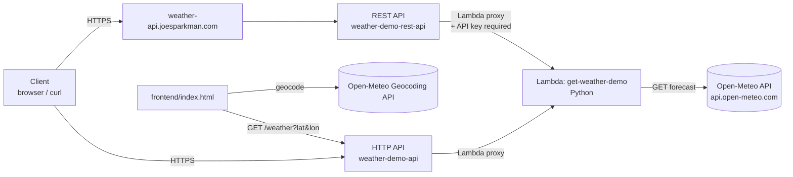

# Weather API — AWS API Gateway Learning Project

A hands-on project built to learn Amazon API Gateway from the ground up: a Lambda function that pulls live data from a public weather API, fronted by two different API Gateway configurations to compare their capabilities — culminating in a fully custom domain with HTTPS, API key authentication, and usage throttling, plus a small frontend so it's actually usable rather than just a curl demo.

## Why this exists

Built while preparing for the AWS Certified Developer – Associate exam, as a practical companion to the API Gateway (and Deployment/IaC) objectives on that exam: Lambda integrations, HTTP vs. REST API types, CORS, API keys and usage plans, custom domain mapping, and infrastructure as code. Rather than just reading about these features, this project exercises each one against a real, working endpoint.

## Project structure

```
weather-api-portfolio-project/
├── README.md
├── lambda/
│   └── get_weather.py       # the Lambda function behind both APIs
├── infrastructure/
│   └── template.yaml        # CloudFormation template (Lambda + both APIs)
└── frontend/
    └── index.html           # single-page "type a city, get the weather" demo
```

## Architecture



Both API Gateway front doors call the **same** Lambda function, which fetches current weather conditions from [Open-Meteo](https://open-meteo.com/) (a free, no-auth-required public API) based on a `lat`/`lon` query string, defaulting to Atlanta, GA when none is provided.

## Components

| Component | Purpose |
|---|---|
| **Lambda function** (`get-weather-demo`, Python) | Reads `lat`/`lon` from the incoming request, calls Open-Meteo, returns current conditions as JSON. Handles upstream failures gracefully (502 instead of an unhandled crash) |
| **HTTP API** (`weather-demo-api`) | Lightweight, low-cost API type. Open and CORS-enabled — what the frontend calls |
| **REST API** (`weather-demo-rest-api`) | Full-featured API type. Requires an API key and sits behind a usage plan (throttling/quota) — features not available on HTTP APIs |
| **Custom domain** (`weather-api.joesparkman.com`) | Regional custom domain backed by an ACM certificate, DNS-validated and mapped through GoDaddy (this domain isn't delegated to Route 53) |
| **frontend/index.html** | Type a city, see the current weather — geocodes the name via Open-Meteo's free geocoding API, then calls the HTTP API above |

## Deploying the infrastructure

The core resources (Lambda, both APIs, API key, usage plan) are defined in `infrastructure/template.yaml` and can be deployed with the AWS CLI:

```bash
aws cloudformation deploy \
  --template-file infrastructure/template.yaml \
  --stack-name weather-api-demo \
  --capabilities CAPABILITY_IAM
```

After it finishes, get the invoke URLs and API key:

```bash
aws cloudformation describe-stacks \
  --stack-name weather-api-demo \
  --query "Stacks[0].Outputs"

aws apigateway get-api-key \
  --api-key <ApiKeyId from the outputs above> \
  --include-value --query value --output text
```

**What's intentionally left out of the template:** the custom domain. Since `joesparkman.com`'s DNS is managed in GoDaddy rather than Route 53, the certificate validation record and the final domain-mapping CNAME have to be added by hand — plain CloudFormation can't reach into an external registrar's DNS. Those manual steps are documented below, exactly as they were done originally.

## Custom domain setup (manual, one-time)

1. Requested a public certificate for `weather-api.joesparkman.com` in ACM (`us-east-2` — matching the REST API's region; regional custom domains need the cert in the same region as the API, unlike edge-optimized domains which require `us-east-1`).
2. Added the ACM-provided CNAME validation record in GoDaddy's DNS manager to prove domain ownership.
3. Once issued, created a **regional** custom domain name in API Gateway and attached the certificate.
4. Mapped the custom domain to the `weather-demo-rest-api` / `dev` stage.
5. Added a second CNAME record in GoDaddy pointing `weather-api` at the API Gateway–generated regional domain target.

**Result:** `https://weather-api.joesparkman.com/weather` resolves through GoDaddy DNS → API Gateway custom domain → REST API → Lambda → Open-Meteo, with the API key requirement enforced the whole way through.

## Running the frontend

`frontend/index.html` is a static, dependency-free page — open it directly in a browser, or serve it from anywhere (GitHub Pages, S3 + CloudFront, or alongside your existing portfolio site).

Before using it, open the file and update the `API_URL` constant near the top of the `<script>` block to point at your own deployed HTTP API invoke URL (the `HttpApiUrl` CloudFormation output, or your console-created one).

It works in two steps: it geocodes whatever location you type using Open-Meteo's free geocoding API to get coordinates, then calls your weather API with those coordinates and renders the result. No backend of your own is needed beyond the Lambda/API Gateway stack already described here.

## Testing summary

| Test | Expected | Result |
|---|---|---|
| `GET /weather` (HTTP API, no params) | Atlanta weather, 200 | ✅ |
| `GET /weather?lat=..&lon=..` (HTTP API) | Weather for given coordinates | ✅ |
| Cross-origin `fetch()` from unrelated domain (HTTP API) | Succeeds due to CORS | ✅ |
| `GET /weather` (REST API, no API key) | `403 Forbidden` | ✅ |
| `GET /weather` (REST API, valid `x-api-key`) | 200 with weather data | ✅ |
| `GET /weather` via custom domain, no key | `403 Forbidden` | ✅ |
| `GET /weather` via custom domain, valid key | 200 with weather data | ✅ |

## Cost notes

Everything here runs comfortably within AWS free-tier limits at demo scale: Lambda's free tier (1M requests/month), API Gateway's per-request pricing (negligible at test volumes), and ACM certificates (free for use with API Gateway). No load balancer, VPC endpoint, or other standing infrastructure is provisioned by a *regional* custom domain — that's specific to *edge-optimized* domains, which provision a CloudFront distribution instead.

The API key used by the REST API is stored in AWS Systems Manager Parameter Store (SecureString) rather than Secrets Manager, to keep ongoing cost at zero.

## Possible next steps

- Host `frontend/index.html` properly (S3 static website + CloudFront, or as a page on joesparkman.com) so it's a live, linkable demo rather than a local file
- Add a request validator on the REST API to practice input validation on the `lat`/`lon` parameters
- Add a Lambda authorizer as an alternative auth pattern to API keys
- Migrate `joesparkman.com` DNS to Route 53 to fully automate the custom domain in CloudFormation
- Package the Lambda code from `lambda/get_weather.py` properly (via SAM or `aws cloudformation package`) instead of the inline `ZipFile` used in the template for simplicity

## Skills demonstrated

Lambda function development (Python) · API Gateway HTTP & REST APIs · Lambda proxy integration · route/resource/method configuration · CORS · API keys & usage plans (throttling and quota) · AWS Certificate Manager (DNS-validated certificates) · custom domain mapping (regional endpoints) · third-party DNS configuration (GoDaddy) alongside AWS-native services · infrastructure as code (CloudFormation) · a small vanilla-JS frontend consuming the deployed API
